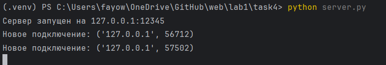
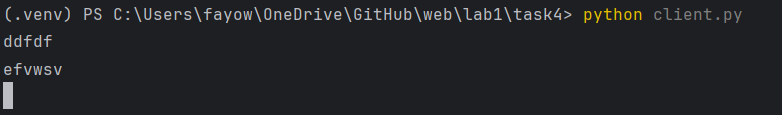
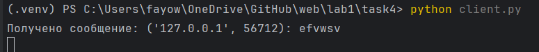
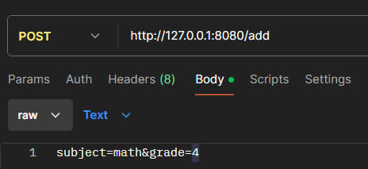
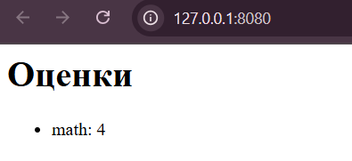
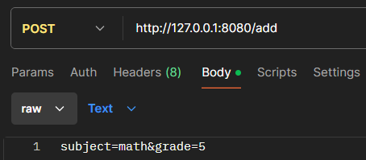
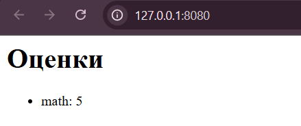

# Лабораторная работа 1

### Цель работы
Овладеть практическими навыками и умениями реализации web-серверов и использования сокетов.

## Ход работы

### Первое задание - Hello

Реализовать клиентскую и серверную часть приложения.
Клиент отправляет серверу сообщение «Hello, server», и оно
должно отобразиться на стороне сервера.
В ответ сервер отправляет клиенту сообщение «Hello, client»,
которое должно отобразиться у клиента.

Код сервера:
``` py title="task1/server.py" linenums="1"
import socket

serverSock = socket.socket(socket.AF_INET, socket.SOCK_DGRAM)

server_address = ("127.0.0.1", 7777)
serverSock.bind(server_address)
print("Сервер запущен ;)")

try:
    while True:
        data, client_address = serverSock.recvfrom(1024)
        print(f"Сообщение от клиента {client_address}: {data.decode()}")

        response = "Hello, client"
        serverSock.sendto(response.encode(), client_address)
        print(f"Ответ отправлен клиенту {client_address}")
except Exception as serverExc:
    print(f"Ошибка: {serverExc}")
finally:
    serverSock.close()
    print("Сервер остановлен.")

```


Код клиента:

``` py title="task1/client.py" linenums="1"
import socket

clientSock = socket.socket(socket.AF_INET, socket.SOCK_DGRAM)

server_address = ("127.0.0.1", 7777)

try:
    message = "Hello, server"
    clientSock.sendto(message.encode(), server_address)
    print(f"Сообщение отправлено серверу: {message}")

    data, server = clientSock.recvfrom(1024)
    print(f"Ответ от сервера: {data.decode()}")
except Exception as clientExc:
    print(f"Ошибка: {clientExc}")
finally:
    clientSock.close()
    print("Клиент завершил работу.")
```


Результат:

``` py title="task1/server.py" 
Сервер запущен ;)
Сообщение от клиента ('127.0.0.1', 61645): Hello, server
Ответ отправлен клиенту ('127.0.0.1', 61645)
```

``` py title="task1/client.py" 
Сообщение отправлено серверу: Hello, server
Ответ от сервера: Hello, client
Клиент завершил работу.
```

### Второе задание - Площадь трапеции

Реализовать клиентскую и серверную часть приложения.
Клиент запрашивает выполнение математической операции,
параметры которой вводятся с клавиатуры.
Сервер обрабатывает данные и возвращает результат клиенту.
Площадь трапеции. Реализовать с помощью протокола TCP.

Код сервера:

``` py title="task2/server.py" linenums="1"
# TCP сервер для вычисления площади трапеции
import socket

def calculate_trapezoid_area(a, b, h):
    """Вычисляет площадь трапеции."""
    return 0.5 * (a + b) * h

# Создаем TCP-сокет
serverSock = socket.socket(socket.AF_INET, socket.SOCK_STREAM)

# Привязываем сокет к IP-адресу и порту
server_address = ("127.0.0.1", 7777)
serverSock.bind(server_address)
serverSock.listen(1)
print("Сервер запущен и ожидает подключения...")

while True:
    # Принимаем соединение от клиента
    connection, client_address = serverSock.accept()
    try:
        print(f"Подключение от клиента: {client_address}")

        # Получаем данные от клиента
        data = connection.recv(1024).decode()
        print(f"Получено сообщение от клиента: {data}")

        # Разбираем данные и вычисляем площадь
        try:
            a, b, h = map(float, data.split())
            area = calculate_trapezoid_area(a, b, h)
            response = f"Площадь трапеции: {area:.2f}"
        except ValueError:
            response = "Ошибка: Проверьте введенные данные. Ожидаются три числа: a, b, h."

        # Отправляем ответ клиенту
        connection.sendall(response.encode())
    finally:
        connection.close()
        print(f"Соединение с {client_address} закрыто.")
```

Код клиента:

``` py title="task2/client.py" linenums="1"
import socket

clientSock = socket.socket(socket.AF_INET, socket.SOCK_STREAM)

server_address = ("127.0.0.1", 7777)
clientSock.connect(server_address)

try:
    print("Ввод параметров трапеции.")
    a = input("Введите a: ")
    b = input("Введите b: ")
    h = input("Введите h: ")

    message = f"{a} {b} {h}"
    clientSock.sendall(message.encode())
    print(f"Отправлено сообщение серверу: {message}")

    data = clientSock.recv(1024).decode()
    print(f"Ответ от сервера: {data}")
finally:
    clientSock.close()
    print("Клиент завершил работу.")
```

Результат:

``` py title="task2/server.py" 
Сервер запущен и ожидает подключения...
Подключение от клиента: ('127.0.0.1', 56579)
Получено сообщение от клиента: 2 3 4
Соединение с ('127.0.0.1', 56579) закрыто.
```

``` py title="task2/client.py" 
Ввод параметров трапеции.
Введите a: 2
Введите b: 3
Введите h: 4
Отправлено сообщение серверу: 2 3 4
Ответ от сервера: Площадь трапеции: 10.00
Клиент завершил работу.
```

### Третье задание - HTML 

Реализовать серверную часть приложения. Клиент подключается к серверу. В ответ
клиент получает http-сообщение, содержащее html-страницу, которую сервер
подгружает из файла index.html.

Код сервера:

``` py title="task3/server.py" linenums="1"
import socket

def load_html(filename):
    try:
        with open(filename, 'r', encoding='utf-8') as file:
            return file.read()
    except FileNotFoundError:
        return "<html><body><h1>Ошибка 404: Файл не найден</h1></body></html>"

serverSock = socket.socket(socket.AF_INET, socket.SOCK_STREAM)

server_address = ("127.0.0.1", 8080)
serverSock.bind(server_address)
serverSock.listen(1)
print("Сервер запущен и ожидает подключения...")

while True:
    connection, client_address = serverSock.accept()
    try:
        print(f"Подключение от клиента: {client_address}")

        request = connection.recv(1024).decode()
        print(f"Получен HTTP-запрос: {request}")
        # читка
        html_content = load_html("index.html")

        response = (
            "HTTP/1.1 200 OK\r\n"
            "Content-Type: text/html; charset=utf-8\r\n"
            f"Content-Length: {len(html_content)}\r\n"
            "\r\n"
            f"{html_content}"
        )
        # jnghfdrf овтета клиенту
        connection.sendall(response.encode())
    finally:
        connection.close()
        print(f"Соединение с {client_address} закрыто.")

#  http://127.0.0.1:8080/
```

Код HTML-страницы:
``` html title="index.html" linenums="1"
<!DOCTYPE html>
<html lang="ru">
<head>
    <meta charset="UTF-8">
    <meta name="viewport" content="width=device-width, initial-scale=1.0">
    <title>Владимир Маяковский - Послушайте!</title>
    <style>
        body {
            font-family: Arial, sans-serif;
            background-color: #f4f4f4;
            color: #333;
            line-height: 1.6;
            margin: 20px;
            padding: 20px;
        }
        h1, h2 {
            text-align: center;
            color: #444;
        }
        .poem {
            max-width: 600px;
            margin: 20px auto;
            padding: 10px;
            background-color: #fff;
            box-shadow: 0 4px 6px rgba(0, 0, 0, 0.1);
            border-radius: 8px;
        }
        .poem p {
            text-indent: 20px;
        }
    </style>
</head>
<body>
    <h1>Владимир Маяковский</h1>
    <h2>Послушайте!</h2>
    <div class="poem">
        <p>Послушайте!</p>
        <p>Ведь, если звезды зажигают —<br>
        значит — это кому-нибудь нужно?</p>
        <p>Значит — кто-то хочет, чтобы они были?</p>
        <p>Значит — кто-то называет эти плевочки<br>
        жемчужиной?</p>
        <p>И, надрываясь<br>
        в метелях полуденной пыли,<br>
        врывается к богу,<br>
        боится, что опоздал,<br>
        плачет,<br>
        целует ему жилистую руку,<br>
        просит —<br>
        чтобы обязательно была звезда! —<br>
        клянется —<br>
        не перенесет эту беззвездную муку!</p>
        <p>А после<br>
        ходит тревожный,<br>
        но спокойный наружно.</p>
        <p>Говорит кому-то:<br>
        «Ведь теперь тебе ничего?<br>
        Не страшно?<br>
        Да?!»</p>
        <p>Послушайте!<br>
        Ведь, если звезды<br>
        зажигают —<br>
        значит — это кому-нибудь нужно?<br>
        Значит — это необходимо,<br>
        чтобы каждый вечер<br>
        над крышами<br>
        загоралась хоть одна звезда?!</p>
    </div>
</body>
</html>
```

Результат:
``` html title="task3/server" linenums="1"
Сервер запущен и ожидает подключения...
Подключение от клиента: ('127.0.0.1', 56630)
Получен HTTP-запрос: 
Соединение с ('127.0.0.1', 56630) закрыто.
Подключение от клиента: ('127.0.0.1', 56631)
Получен HTTP-запрос: GET / HTTP/1.1
Host: 127.0.0.1:8080
Connection: keep-alive
```
... и т.д.

### Четвертое задание - Чат

Реализовать двухпользовательский или многопользовательский чат.
Реализовать с помощью протокола TCP – 100% баллов, с помощью UDP – 80%.
Обязательно использовать библиотеку threading.
Для реализации с помощью UDP, thearding использовать для получения
сообщений у клиента.
Для применения с TCP необходимо запускать клиентские подключения И прием
и отправку сообщений всем юзерам на сервере

Код сервера:

``` py title="task4/server.py" linenums="1"
import socket
import threading

HOST = '127.0.0.1'  # Локальный хост
PORT = 12345  # Порт для прослушивания

clients = []


def broadcast(message, sender_socket=None):
    # Рассылка сообщения всем клиентам, кроме отправителя.
    for client in clients:
        if client != sender_socket:
            try:
                client.send(message.encode())
            except Exception as e:
                print(f"Ошибка при отправке сообщения: {e}")
                clients.remove(client)


def handle_client(client_socket, client_address):
    # Обработка сообщений от клиента.
    while True:
        try:
            message = client_socket.recv(1024).decode()
            if not message:
                break
            message = f"{client_address}: {message}"
            broadcast(message, sender_socket=client_socket)
        except Exception as e:
            print(f"Ошибка связи с клиентом: {e}")
            break

    clients.remove(client_socket)
    client_socket.close()


def start_server():
    # Запуск сервера.
    server = socket.socket(socket.AF_INET, socket.SOCK_STREAM)
    server.bind((HOST, PORT))
    server.listen()
    print(f"Сервер запущен на {HOST}:{PORT}")

    while True:
        client_socket, client_address = server.accept()
        print(f"Новое подключение: {client_address}")

        clients.append(client_socket)

        client_thread = threading.Thread(target=handle_client, args=(client_socket, client_address))
        client_thread.start()


if __name__ == "__main__":
    start_server()
```

Код клиентов:
``` py title="task4/client.py" linenums="1"
import socket
import threading

HOST = '127.0.0.1'  # Адрес сервера
PORT = 12345        # Порт сервера

def receive_messages(sock):
    # Функция для получения сообщений от сервера.
    while True:
        try:
            message = sock.recv(1024).decode()
            if message:
                print(f"Получено сообщение: {message}")
            else:
                break
        except:
            print("Соединение закрыто.")
            break

def start_client():
    # Функция для запуска клиента.
    sock = socket.socket(socket.AF_INET, socket.SOCK_STREAM)
    sock.connect((HOST, PORT))

    # Запуск потока для получения сообщений
    threading.Thread(target=receive_messages, args=(sock,)).start()
    threading.Thread(target=send_messages, args=(sock,)).start()


def send_messages(sock):
    # Отправка сообщений
    while True:
        message = input()
        if message.lower() == 'exit':
            break
        sock.send(message.encode())
    sock.close()

if __name__ == "__main__":

    start_client()
```

Результат:

Сервер:


Клиент 1:


Клиент 2:


### Пятое задание - web-сервер
Необходимо написать простой web-сервер для обработки GET и POST http-запросов средствами Python и библиотеки socket.

Задание: сделать сервер, который может:

* Принять и записать информацию о дисциплине и оценке по дисциплине.
* Отдать информацию обо всех оценках по дисциплине в виде html-страницы.

Код сервера:
```
import socket
import threading

# Настройки сервера
HOST = '127.0.0.1'  # Адрес сервера
PORT = 8080  # Порт сервера

# Создаем сокет
server_socket = socket.socket(socket.AF_INET, socket.SOCK_STREAM)
server_socket.bind((HOST, PORT))
server_socket.listen(2)  # Ограничиваем количество одновременных подключений

print(f"Сервер запущен на http://{HOST}:{PORT}")

# Словарь для хранения дисциплин и оценок
grades = {}


def handle_request(client_socket):
    # Получаем данные от клиента
    request_data = client_socket.recv(1024).decode()
    print(f"Получен запрос:\n{request_data}")

    # Разбираем HTTP-заголовки
    headers = request_data.split('\n')
    method = headers[0].split()[0]  # GET или POST
    path = headers[0].split()[1]  # Путь запроса

    # Обработка GET-запроса
    if method == 'GET' and path == '/':
        # Формируем HTML-страницу с оценками
        html_content = "<html><body><h1>Оценки</h1><ul>"
        for subject, grade in grades.items():
            html_content += f"<li>{subject}: {grade}</li>"
        html_content += "</ul></body></html>"

        # Отправляем HTTP-ответ с указанием кодировки
        response = (
            "HTTP/1.1 200 OK\n"
            "Content-Type: text/html; charset=utf-8\n\n"  # Указываем кодировку
            f"{html_content}"
        )
        client_socket.send(response.encode())

    # Обработка POST-запроса
    elif method == 'POST' and path == '/add':
        # Извлекаем данные из тела запроса
        body = request_data.split('\n')[-1]
        subject = body.split('&')[0].split('=')[1]
        grade = body.split('&')[1].split('=')[1]

        # Сохраняем данные в словарь
        grades[subject] = grade

        # Отправляем HTTP-ответ
        response = (
            "HTTP/1.1 200 OK\n"
            "Content-Type: text/plain; charset=utf-8\n\n"  # Указываем кодировку
            "Данные успешно добавлены!"
        )
        client_socket.send(response.encode())

    # Если запрос не распознан
    else:
        response = (
            "HTTP/1.1 404 Not Found\n"
            "Content-Type: text/plain; charset=utf-8\n\n"  # Указываем кодировку
            "Страница не найдена"
        )
        client_socket.send(response.encode())

    # Закрываем соединение
    client_socket.close()


# Основной цикл сервера
while True:
    # Принимаем подключение
    client_socket, client_address = server_socket.accept()
    print(f"Подключение от {client_address}")

    # Обрабатываем запрос
    client_thread = threading.Thread(target=handle_request, args=(client_socket,))
    client_thread.start()
```

Результат:

POST запрос 1:



POST запрос 2:



## Вывод
При выполнении работы приобрел и попрактиковал навыки использовая сокетов и реализации web-серверов