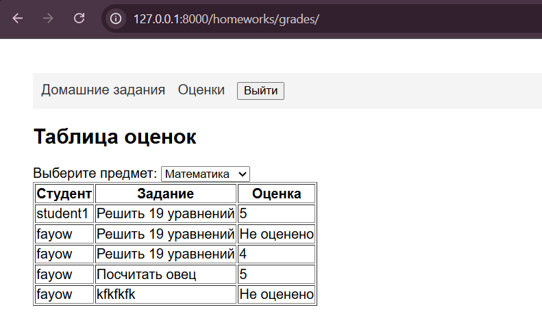

# Вторая лаба

### Практическая работа 2

В проекте создать модель данных об автовладельцах в соответствии с рисунком 2.
```py 
from django.db import models

class Car(models.Model):
    state_number = models.CharField(max_length=15)
    brand = models.CharField(max_length=20)
    model = models.CharField(max_length=20)
    color = models.CharField(max_length=30, null=True)

class Owner(models.Model):
    surname = models.CharField(max_length=30)
    name = models.CharField(max_length=30)
    birth_day = models.DateTimeField(null=True)

class Own(models.Model):
    owner = models.ForeignKey(Owner, on_delete=models.CASCADE, null=True)
    car = models.ForeignKey(Car, on_delete=models.CASCADE, null=True)
    date_start = models.DateTimeField()
    date_end = models.DateTimeField(null=True)

class License(models.Model):
    owner = models.ForeignKey(Owner, on_delete=models.CASCADE)
    number = models.CharField(max_length=10)
    type = models.CharField(max_length=10)
    date_issue = models.DateTimeField()
```

Создать миграции:

```
py manage.py makemigrations
```

Необходимо заполнить таблицы данными средствами админ-панели.
Зарегистрировать владельца авто в админ-панели.


Создать в файле views.py (находится в папке приложения) представление (контроллер), который выводит из базы данных данные о владельце автомобиля. 
```
from django.shortcuts import render
from .models import Owner

def owner_detail(request, id_owner):
    owner = Owner.objects.get(pk=id_owner)
    context = {
        'name': owner.name,
        'surname': owner.surname,
        'birth_day': owner.birth_day,
    }
    return render(request, 'owner.html', context)
```

Работа с адресацией:

project_first_app\urls.py:
``` py
from django.urls import path
from . import views

urlpatterns = [
    path('owner/<int:id_owner>/', views.owner_detail)
]
```

django_project_faizulin\urls.py:
```
from django.contrib import admin
from django.urls import path, include


urlpatterns = [
    path('admin/', admin.site.urls),
    path('', include('project_first_app.urls')),
]
```


### Лабораторная работа 2
Реализация простого сайта средствами Django - Доска домашних заданий
### Цель работы
Овладеть практическими навыками и умениями реализации web-сервисов
средствами Django
### Models
```
from django.db import models
from django.contrib.auth.models import User


class Profile(models.Model):
    user = models.OneToOneField(User, on_delete=models.CASCADE)
    first_name = models.CharField(max_length=100)
    last_name = models.CharField(max_length=100)
    class_name = models.CharField(max_length=50, null=True, blank=True)

    def __str__(self):
        return f"Профиль пользователя {self.user}"


class Subject(models.Model):
    name = models.CharField(max_length=100)

    def __str__(self):
        return f"{self.name}"


class Homework(models.Model):
    subject = models.ForeignKey(Subject, on_delete=models.CASCADE)
    teacher = models.ForeignKey(User, on_delete=models.CASCADE)
    issue_date = models.DateField()
    deadline = models.DateField()
    description = models.TextField()
    penalties_info = models.TextField()

    def __str__(self):
        return self.description


class Submission(models.Model):
    student = models.ForeignKey(User, on_delete=models.CASCADE)
    homework = models.ForeignKey(Homework, on_delete=models.CASCADE)
    text_submission = models.TextField()
    grade = models.IntegerField(blank=True, null=True)

    def __str__(self):
        return self.text_submission
```

###Urls
```
from . import views
from django.urls import path

urlpatterns = [
    path('homeworks/', views.homework_list, name='homework_list'),
    path('login/', views.login_view, name='login'),
    path('logout/', views.logout_view, name='logout'),
    path('homeworks/grades/', views.grades_table, name='grades_table'),
    path('homeworks/<int:homework_id>/', views.submit_homework, name='submit_homework'),
]
```
###Views
```
from django.http import HttpResponseForbidden
from django.template.context_processors import request

from .forms import SubmissionForm
from .models import Homework, Submission, Subject, Profile
from django.contrib.auth import authenticate, login, logout
from django.shortcuts import render, get_object_or_404, redirect


def submit_homework(request, homework_id):
    # homework = Homework.objects.get(id=homework_id)
    homework = get_object_or_404(Homework, id=homework_id)
    user = request.user
    if request.method == 'GET':
        if not request.user.is_authenticated:
            return HttpResponseForbidden("Нужно войти.")

        has_submitted = Submission.objects.filter(student=user, homework=homework).exists()

        context = {'homework': homework, 'has_submitted': has_submitted}

        if has_submitted:
            # Если задание уже отправлено, перенаправить на страницу "уже отправлено"
            # return redirect('already_submitted', homework_id=homework_id)
            return render(request, 'already_submitted.html', {'homework_id': homework_id})
        else:
            # Если задание не отправлено, отобразить страницу для отправки задания
            return render(request, 'submit_homework.html', context)
    if request.method == 'POST':
        form = SubmissionForm(request.POST)
        if form.is_valid():
            submission = form.save(commit=False)
            submission.homework = homework
            submission.student = user
            submission.save()
        return redirect('/homeworks/')


# def already_submitted(request, homework_id):
#     homework = get_object_or_404(Homework, pk=homework_id)
#     if request.method == 'POST':
#         text_submission = request.POST.get('text_submission')
#         user = request.user
#         Submission.objects.create(student=user, homework=homework, text_submission=text_submission)
#         return render(request, 'already_submitted.html', {'homework_id': homework_id})
#     else:
#         return render(request, 'already_submitted.html', {'homework_id': homework_id})


def logout_view(request):
    logout(request)
    # После выхода из системы перенаправляем на страницу входа (или другую страницу по вашему выбору)
    return redirect('login')


def homework_list(request):
    subjects = Subject.objects.all()
    homeworks = Homework.objects.all()

    selected_subject = request.GET.get('selected_subject')
    if selected_subject:
        homeworks = homeworks.filter(subject__name=selected_subject)

    return render(request, 'homework_list.html', {
        'homeworks': homeworks,
        'subjects': subjects,
        'selected_subject': selected_subject,  # Передаем выбранный предмет в шаблон
    })

def grades_table(request):
    subjects = Subject.objects.all()

    if request.method == 'POST':
        subject_id = request.POST.get('subject')
        selected_subject = get_object_or_404(Subject, pk=subject_id)
        submissions = Submission.objects.filter(homework__subject=selected_subject)
    else:
        selected_subject = subjects.first()
        submissions = Submission.objects.filter(homework__subject=selected_subject)


    return render(request, 'grades_table.html', {
        'submissions': submissions,
        'subjects': subjects,
        'selected_subject': selected_subject,  # Передаем выбранный предмет в шаблон
    })

def login_view(request):
    if request.method == 'POST':
        username = request.POST.get('username')
        password = request.POST.get('password')

        user = authenticate(request, username=username, password=password)

        if user is not None:
            login(request, user)
            if user.is_authenticated and user.username == 'Teacher' or user.username == 'home':
                return redirect('/admin/')
            else:
                return redirect('/homeworks/')
        else:
            return render(request, 'login.html', {'error_message': 'Неверные учетные данные'})

    return render(request, 'login.html')

def logout_view(request):
    if request.method == "POST":
        logout(request)
        return redirect("login")
```

### Сайт

Вход


Журнал


Сдача задания


Оценки


Панель учителя


### Вывод

Научился реализовывать свой сайт используя фреймворк Django на примере школьного журнала :)