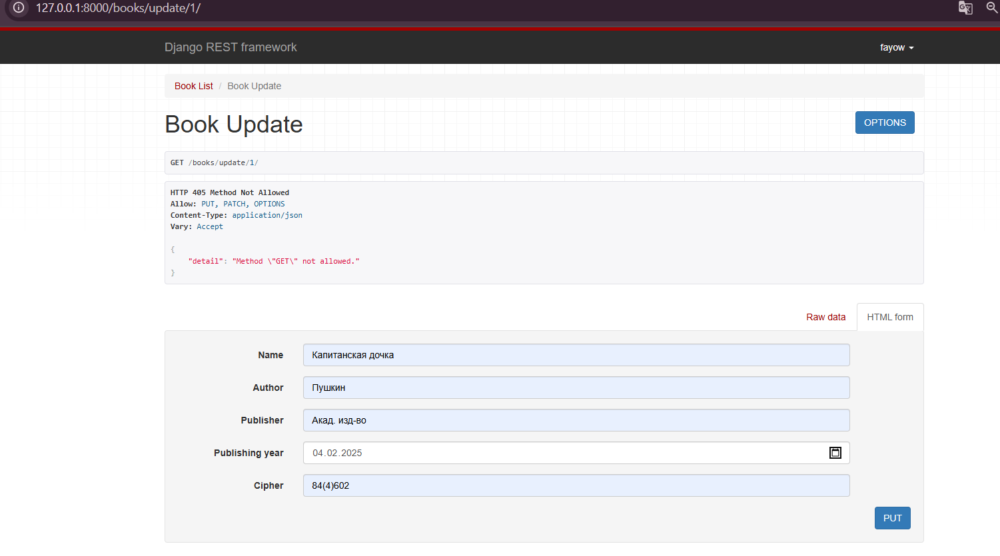
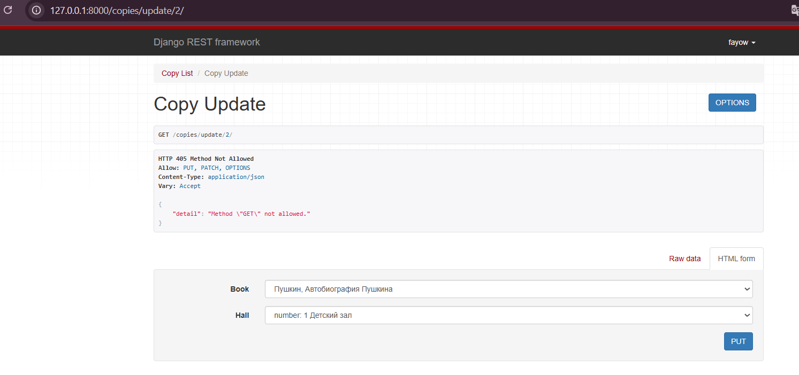
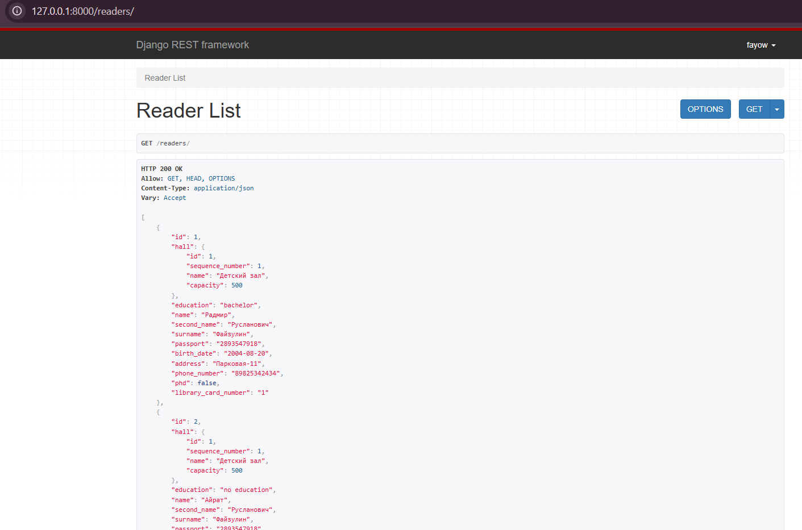

# Лабораторная работа 3

### Цель работы

Описать базу данных средствами Django ORM.
Мне достался вариант "Библиотека"

### Models

```
from django.db import models
# from datetime import datetime
from django.utils import timezone

class Book(models.Model):
    name = models.CharField(max_length=200)
    author = models.CharField(max_length=200)
    publisher = models.CharField(max_length=200)
    publishing_year = models.DateField()
    cipher = models.CharField(max_length=10)

    def __str__(self):
        return "{}, {}".format(self.author, self.name)


class Hall(models.Model):
    sequence_number = models.IntegerField()
    name = models.CharField(max_length=200)
    capacity = models.IntegerField()

    def __str__(self):
        return "number: {} {}".format(self.sequence_number, self.name)


class Copy(models.Model):
    book = models.ForeignKey(Book, on_delete=models.CASCADE)
    hall = models.ForeignKey(Hall, on_delete=models.CASCADE)

    def __str__(self):
        return "{} {}".format(self.book, self.hall)


class Reader(models.Model):
    EDUCATIONS = [
        ('0', 'no education'),
        ('1', 'elementary'),
        ('2', 'middle'),
        ('3', 'bachelor'),
        ('4', 'master')
    ]
    name = models.CharField(max_length=50)
    second_name = models.CharField(max_length=50)
    surname = models.CharField(max_length=50)
    passport = models.CharField(max_length=10)
    birth_date = models.DateField()
    address = models.CharField(max_length=100)
    phone_number = models.CharField(max_length=11)
    education = models.CharField(choices=EDUCATIONS, default='0', max_length=1)
    phd = models.BooleanField()
    hall = models.ForeignKey(Hall, on_delete=models.CASCADE)
    library_card_number = models.CharField(max_length=10)

    def __str__(self):
        return "{} {} {}".format(self.surname, self.name, self.second_name)


class Assignment(models.Model):
    copy = models.ForeignKey(Copy, on_delete=models.CASCADE)
    reader = models.ForeignKey(Reader, on_delete=models.CASCADE)
    date_assigned = models.DateField(default=timezone.now)
    date_returned = models.DateField(default=None, blank=True, null=True)
```

### Urls

```
from django.urls import path, include
from .views import *

urlpatterns = [
    path('auth/', include('djoser.urls')),
    path('auth/', include('djoser.urls.authtoken')),

    path('books/', BookListView.as_view()),
    path('books/<int:pk>/', BookRetrieveView.as_view()),
    path('books/update/<int:pk>/', BookUpdateView.as_view()),
    path('books/new/', BookCreateView.as_view()),

    path('halls/', HallListView.as_view()),
    path('halls/<int:pk>/', HallRetrieveView.as_view()),
    path('halls/update/<int:pk>/', HallUpdateView.as_view()),
    path('halls/new/', HallCreateView.as_view()),

    path('copies/', CopyListView.as_view()),
    path('copies/<int:pk>/', CopyRetrieveView.as_view()),
    path('copies/update/<int:pk>/', CopyUpdateView.as_view()),
    path('copies/new/', CopyCreateView.as_view()),

    path('readers/', ReaderListView.as_view()),
    path('readers/<int:pk>/', ReaderRetrieveView.as_view()),
    path('readers/update/<int:pk>/', ReaderUpdateView.as_view()),
    path('readers/new/', ReaderCreateView.as_view()),
    path('readers/assignments/<int:pk>/', ReaderRetrieveAssignmentsView.as_view()),
    path('readers/debtors/', ReadersRetrieveDebtorView.as_view()),
    path('readers/young/', YoungReadersCountView.as_view()),
    path('readers/education/', ReadersEducationCountView.as_view()),

    path('assignments/', AssignmentListView.as_view()),
    path('assignments/<int:pk>/', AssignmentRetrieveView.as_view()),
    path('assignments/update/<int:pk>/', AssignmentUpdateView.as_view()),
    path('assignments/new/', AssignmentCreateView.as_view()),
]
```

### Serializer

```
from rest_framework import serializers
from .models import *
from django.contrib.auth.models import User


class UserSerializer(serializers.ModelSerializer):
    class Meta:
        model = User
        fields = ['username', 'email', 'first_name', 'last_name']


class BookSerializer(serializers.ModelSerializer):
    class Meta:
        model = Book
        fields = '__all__'

class BookShortSerializer(serializers.ModelSerializer):
    class Meta:
        model = Book
        fields = ['name', 'author']

class HallSerializer(serializers.ModelSerializer):
    class Meta:
        model = Hall
        fields = '__all__'


class CopySerializer(serializers.ModelSerializer):
    book = BookSerializer()
    hall = HallSerializer()
    class Meta:
        model = Copy
        fields = '__all__'


class CreateCopySerializer(serializers.ModelSerializer):
    class Meta:
        model = Copy
        fields = '__all__'

class CopyShortSerializer(serializers.ModelSerializer):
    book = BookShortSerializer()
    class Meta:
        model = Copy
        fields = ['book']

class ReaderSerializer(serializers.ModelSerializer):
    hall = HallSerializer()
    education = serializers.CharField(source='get_education_display')

    class Meta:
        model = Reader
        fields = '__all__'


class CreateReaderSerializer(serializers.ModelSerializer):
    class Meta:
        model = Reader
        fields = '__all__'


class EducationSerializer(serializers.Serializer):
    education = serializers.CharField()
    education_name = serializers.SerializerMethodField()
    percentage = serializers.SerializerMethodField()

    def get_education_name(self, object):
        return dict(Reader.EDUCATIONS).get(object['education'], object['education'])

    def get_percentage(self, object):
        readers_cnt = Reader.objects.count()
        education_cnt = Reader.objects.filter(education=object['education']).count()
        return (education_cnt / readers_cnt) * 100

    def create(self, validated_data):
        pass


class ReaderShortSerializer(serializers.ModelSerializer):
    class Meta:
        model = Reader
        fields = ['name', 'second_name', 'surname']


class AssignmentSerializer(serializers.ModelSerializer):
    copy = CopySerializer()
    reader = ReaderSerializer()

    class Meta:
        model = Assignment
        fields = '__all__'

class AssignmentShortSerializer(serializers.ModelSerializer):
    copy = CopyShortSerializer()

    class Meta:
        model = Assignment
        fields = ['copy']


class AssignmentDebtorSerializer(serializers.ModelSerializer):
    reader = ReaderShortSerializer()

    class Meta:
        model = Assignment
        fields = ['reader']


class CreateAssignmentSerializer(serializers.ModelSerializer):
    class Meta:
        model = Assignment
        fields = '__all__'
```


### Views

```
from datetime import timedelta, datetime
from rest_framework.response import Response
from rest_framework import generics
from .serializers import *
from django.db.models import Q
from django.db.models import Count, Subquery
from rest_framework.views import APIView

class BookListView(generics.ListAPIView):
    queryset = Book.objects.all()
    serializer_class = BookSerializer


class BookRetrieveView(generics.RetrieveAPIView):
    queryset = Book.objects.all()
    serializer_class = BookSerializer


class BookUpdateView(generics.UpdateAPIView):
    queryset = Book.objects.all()
    serializer_class = BookSerializer


class BookCreateView(generics.CreateAPIView):
    queryset = Book.objects.all()
    serializer_class = BookSerializer


class HallListView(generics.ListAPIView):
    queryset = Hall.objects.all()
    serializer_class = HallSerializer


class HallRetrieveView(generics.RetrieveAPIView):
    queryset = Hall.objects.all()
    serializer_class = HallSerializer


class HallUpdateView(generics.UpdateAPIView):
    queryset = Hall.objects.all()
    serializer_class = HallSerializer


class HallCreateView(generics.CreateAPIView):
    queryset = Hall.objects.all()
    serializer_class = HallSerializer


class CopyListView(generics.ListAPIView):
    queryset = Copy.objects.all()
    serializer_class = CopySerializer


class CopyRetrieveView(generics.RetrieveAPIView):
    queryset = Copy.objects.all()
    serializer_class = CopySerializer


class CopyUpdateView(generics.UpdateAPIView):
    queryset = Copy.objects.all()
    serializer_class = CreateCopySerializer


class CopyCreateView(generics.CreateAPIView):
    queryset = Copy.objects.all()
    serializer_class = CreateCopySerializer


class ReaderListView(generics.ListAPIView):
    queryset = Reader.objects.all()
    serializer_class = ReaderSerializer


class ReaderRetrieveView(generics.RetrieveAPIView):
    queryset = Reader.objects.all()
    serializer_class = ReaderSerializer


class ReaderUpdateView(generics.UpdateAPIView):
    queryset = Reader.objects.all()
    serializer_class = CreateReaderSerializer


class ReaderCreateView(generics.CreateAPIView):
    queryset = Reader.objects.all()
    serializer_class = CreateReaderSerializer

class ReaderRetrieveAssignmentsView(generics.ListAPIView):
    serializer_class = AssignmentShortSerializer

    def get_queryset(self):
        reader_id = self.kwargs['pk']
        assignment = Assignment.objects.filter(Q(reader__pk=reader_id) & Q(date_returned__isnull=True))
        return assignment


class ReadersRetrieveDebtorView(generics.ListAPIView):
    serializer_class = AssignmentDebtorSerializer

    def get_queryset(self):
        time = datetime.now()
        time -= timedelta(days=30)
        assignments = Assignment.objects.filter(date_assigned__lt=time)
        return assignments


class YoungReadersCountView(APIView):
    def get(self, request):
        time = datetime.now() - timedelta(days=365.25 * 20)
        readers = Reader.objects.filter(birth_date__gt=time).count()

        response = {'Readers under 20': readers}
        return Response(response)


class ReadersEducationCountView(APIView):
    def get(self, request):
        education = [{'education': cur[0]} for cur in Reader.EDUCATIONS]
        serializer = EducationSerializer(data=education, many=True)

        if serializer.is_valid():
            response = {'Education percentage': serializer.data}
            return Response(response)
        else:
            return Response(serializer.errors, status=400)

class AssignmentListView(generics.ListAPIView):
    queryset = Assignment.objects.all()
    serializer_class = AssignmentSerializer


class AssignmentRetrieveView(generics.RetrieveAPIView):
    queryset = Assignment.objects.all()
    serializer_class = AssignmentSerializer


class AssignmentUpdateView(generics.UpdateAPIView):
    queryset = Assignment.objects.all()
    serializer_class = CreateAssignmentSerializer


class AssignmentCreateView(generics.CreateAPIView):
    queryset = Assignment.objects.all()
    serializer_class = CreateAssignmentSerializer
```

### Работа сайта
#### Assignment
get_assignment(index):


get_assignments:


put_assignment:


update_assignment:


#### Book
get_book(index):


get_books:


put_book:


update_book:


#### Copy
get_copy(index):


get_copies:


put_copy:


update_copy:


#### Hall
get_hall(index):


get_halls:


put_hall:


update_hall:


#### Reader
get_reader(index):


get_readers:


put_reader:


update_reader:


Вывод:
научился работать с проектами и приложениями с джанго,
реализовав функционал внутренней системы библиотеки
