# Лабораторная работа 4

### Цель работы

Знакомство с Vue.js, Vuetify и Vue Router

### Components

#### Login.vue

```
<template>
  <div>
    <h2>Login</h2>
    <form @submit.prevent="login">
      <label for="username">Username:</label>
      <input v-model="username" type="text" id="username" required>
      <h1></h1>
      <label for="password">Password:</label>
      <input v-model="password" type="password" id="password" required>
      <h1></h1>
      <button type="submit" class="btn">Login</button>
    </form>
    <router-link to="/registration" class="link">I don't have an account</router-link>
  </div>
</template>

<script>
import api from '@/services/api';

export default {
  data() {
    return {
      username: '',
      password: '',
    };
  },
  methods: {
    login() {
      const credentials = {
        username: this.username,
        password: this.password,
      };

      api.post('/auth/token/login/', credentials)
        .then(response => {
          const token = response.data.auth_token;
          localStorage.setItem('token', token);
          this.$router.push('/books');
        })
        .catch(error => {
          console.error('Login failed:', error);
        });
    },
  },
};
</script>

<style scoped>
.link {
  color: #000;
  font-size: 17px;
}

form {
  margin-bottom: 20px;
}

.btn {
  display: inline-block;
  padding: 10px 20px;
  font-size: 16px;
  font-weight: bold;
  text-align: center;
  color: #fff;
  background-color: red;
  border: none;
  border-radius: 5px;
  cursor: pointer;
  transition: background-color 0.3s;
}

.btn:hover {
  background-color: black; /* Цвет фона кнопки при наведении */
}
</style>
```

#### Registration.vue

```
<template>
    <div class="registraton_container">
        <h1>Registration</h1>
        <form @submit="register">
            <label for="email">Email:</label><br>
            <input v-model="email" type="text" id="email" name="email"><br>
            <label for="username">Username:</label><br>
            <input  v-model="username" type="text" id="username" name="username"><br>
            <label for="password">Password:</label><br>
            <input  v-model="password" type="text" id="password" name="password"><br>
            <button type="submit" class="btn">Submit</button>
        </form>
    </div>
</template>

<script>
import api from '@/services/api'
export default {
    data() {
        return {
            email: '',
            username: '',
            password: ''
        }
    },
    methods: {
        register(event) {
            event.preventDefault();
            const userData = {
                email: this.email,
                username: this.username,
                password: this.password
            }
            api.post('/auth/users/', userData)
                .then(response => {
                    localStorage.setItem('userData', JSON.stringify(formData));
                })
                .catch(error => {
                    // console.log(userData);
                    // console.log(error);
                    console.log('Something went wrong :(')
                })
        }
    }
}
</script>
<style scoped>
    input {
        margin-bottom: 20px;
    }
.btn {
  display: inline-block;
  padding: 10px 20px;
  font-size: 16px;
  font-weight: bold;
  text-align: center;
  color: #fff;
  background-color: red;
  border: none;
  border-radius: 5px;
  cursor: pointer;
  transition: background-color 0.3s;
}

.btn:hover {
  background-color: black; /* Цвет фона кнопки при наведении */
}
</style>
```

#### AllBooks.vue

```
<template>
    <h1>All Books</h1>
    <hr class="h">
    <div v-for="book in Books" :key="book.id">
        <h3> {{ book.name }}</h3>
        <h4>{{ book.author }}</h4>
        <p>{{ book.publisher }}, {{ book.publishing_year }}</p>
        <p>cipher: {{ book.cipher }}</p>
        <hr class="h">
    </div>
</template>

<script>
import api from '@/services/api'
export default {
    data() {
        return {
            Books: [],
        }
    },
    mounted () {
        api.get('/books/')
                .then(response => {
                    this.Books = response.data;
                })
                .catch(error => {
                    console.log('Something went wrong :(')
                })
    }
}
</script>
<style scoped>
  .h {
    width: 619px;
    margin: 10px 0px;
  }
</style>
```

#### NewBook.vue

```
<template>
  <div class="new-book_container">
    <h1>New Book</h1>
    <hr class="h">
    <form @submit="addNewBook">
      <label>Book name:</label><br>
      <input v-model="name" type="text" id="name" name="name"><br>

      <label>Author:</label><br>
      <input v-model="author" type="text" id="author" name="author"><br>

      <label>Publisher:</label><br>
      <input v-model="publisher" type="text" id="publisher" name="publisher"><br>

      <label>Publishing year:</label><br>
      <input v-model="publishingYear" type="date" id="publishingYear" name="publishingYear"><br>

      <label>Cipher:</label><br>
      <input v-model="cipher" type="text" id="cipher" name="cipher"><br>

      <button type="submit" class="btn">Submit</button>
    </form>
  </div>
</template>

<script>
import api from '@/services/api';

export default {
  data() {
    return {
      name: '',
      author: '',
      publisher: '',
      publishingYear: '',
      cipher: ''
    }
  },
  methods: {
    addNewBook(event) {
      event.preventDefault();
      const userData = {
        name: this.name,
        author: this.author,
        publisher: this.publisher,
        publishing_year: this.publishingYear,
        cipher: this.cipher
      }
      api.post('/books/new/', userData)
        .then(response => {
          this.$router.push('/books');
        })
        .catch(error => {
          console.log(userData);
          console.log(error);
          console.log('Something went wrong :(')
        })
    }
  }

}
</script>
<style scoped>
input {
  margin-bottom: 20px;
}

.btn {
  display: inline-block;
  padding: 10px 20px;
  font-size: 16px;
  font-weight: bold;
  text-align: center;
  color: #fff;
  background-color: red;
  border: none;
  border-radius: 5px;
  cursor: pointer;
  transition: background-color 0.3s;
}

.btn:hover {
  background-color: black; /* Цвет фона кнопки при наведении */
}

</style>
<style scoped>
.h {
  width: 619px;
  margin: 10px 0px;
}
</style>
```


#### NavBar.vue

```
<template>
  <nav>
    <ul class="horizontal-menu">
      <li v-for="(menu, index) in menus" :key="index" class="dropdown">
        <span>{{ menu.label }}</span>
        <ul class="dropdown-menu">
          <li v-for="(item, i) in menu.items" :key="i">
            <router-link :to="item.route">{{ item.label }}</router-link>
          </li>
        </ul>
      </li>
      <p v-if="hasToken">
        <router-link to="/logout" class="logout-link">Log out</router-link>
      </p>
      <p v-else>
        <router-link to="/login" class="logout-link">Log in</router-link>
      </p>
    </ul>
  </nav>
</template>

<script>
export default {
  data() {
    return {
      menus: [
        {
          label: 'Books',
          items: [
            { label: 'All Books', route: '/books' },
            { label: 'Add new book', route: '/books/new' },
          ]
        },
        {
          label: 'Readers',
          items: [
            { label: 'All Readers', route: '/readers' },
            { label: 'Add new reader', route: '/readers/new' }
          ]
        },
        {
          label: 'Assignments',
          items: [
            { label: 'All Assignments', route: '/assignments'},
            { label: 'Add new Assignments', route: '/assignments/new'},
          ]
        },
        {
          label: 'Halls',
          items: [
                { label: 'All Halls', route: '/halls'},
                { label: 'Add new Halls', route: '/halls/new'}
          ]
        },
        {
          label: 'Copies',
          items: [
                { label: 'All Copies', route: '/copies'},
                { label: 'Add new Copies', route: '/copies/new'},
          ]
        }
      ]
    }
  },
  computed: {
    hasToken() {
      return !!localStorage.getItem('token');
    }
  }
}
</script>

<style scoped>
.horizontal-menu {
  list-style-type: none;
  margin: 0;
  padding: 0;
  display: flex;
  font-family: Arial, sans-serif;
}

.horizontal-menu li {
  position: relative;
}

.horizontal-menu li .dropdown-menu {
  display: none;
  position: absolute;
  background-color: #f9f9f9;
  box-shadow: 0 8px 16px 0 rgba(0,0,0,0.2);
  z-index: 1;
}

.horizontal-menu li:hover .dropdown-menu {
  display: block;
}

.horizontal-menu li:hover {
  background-color: #ddd;
}

.horizontal-menu li:hover > span {
  background-color: #ddd;
}

.horizontal-menu li span {
  display: block;
  color: black;
  text-align: center;
  padding: 14px 16px;
  text-decoration: none;
}

.horizontal-menu li .dropdown-menu a {
  color: black;
  padding: 12px 16px;
  text-decoration: none;
  display: block;
}

.horizontal-menu li .dropdown-menu a:hover {
  background-color: #f1f1f1;
}


nav {
  background-color: #f0f0f0;
  position: fixed;
  top: 0;
  left: 0;
  width: 100%;
}


.logout-link {
  position: absolute;
  right: 10px;
  top: 50%;
  transform: translateY(-50%);
  color: black;
  text-decoration: none;
}

.logo {
  height: 50px; /* Настройте высоту вашего логотипа */
  width: auto; /* Автоматическое определение ширины */
}
</style>
```

### Router

index.js:

```
import { createRouter, createWebHistory } from 'vue-router'
import RegistrationView from '../views/RegistrationView.vue'
import BooksView from '../views/BooksView.vue'
import NewBookComponent from '../components/NewBook.vue'
import LoginComponent from '../components/Login.vue'
import LogoutComponent from '../components/Logout.vue'
import ReadersComponent from '../components/AllReaders.vue'
import NewReaderComponent from '../components/NewReader.vue'
import AssignmentsComponent from '../components/AllAssignments.vue'
import AssignmentDetailsComponent from '../components/AssignmentDetails.vue'
import EditAssignmentComponent from '../components/EditAssignment.vue'
import NewAssignmentComponent from '../components/NewAssignment.vue'
import HallsComponent from '../components/AllHalls.vue'
import NewHallComponent from '../components/NewHall.vue'
import CopiesComponent from '../components/AllCopies.vue'
import NewCopyComponent from '../components/NewCopy.vue'

const router = createRouter({
  history: createWebHistory(import.meta.env.BASE_URL),
  routes: [
    {
      path: '/registration',
      name: 'registration',
      component: RegistrationView
    },
    {
      path: '/books',
      name: 'books',
      component: BooksView
    },
    {
      path: '/books/new',
      name: 'newBook',
      component: NewBookComponent,
      meta: { requiredAuth: true },
    },
    {
      path: '/login',
      name: 'login',
      component: LoginComponent,
    },
    {
      path: '/logout',
      name: 'logout',
      component: LogoutComponent,
    },
    {
      path: '/readers',
      name: 'readers',
      component: ReadersComponent,
      meta: { requiredAuth: true },
    },
    {
      path: '/readers/new',
      name: 'newReader',
      component: NewReaderComponent,
      meta: { requiredAuth: true },
    },
    {
      path: '/assignments',
      name: 'Assignments',
      component: AssignmentsComponent,
      meta: { requiredAuth: true },
    },
    {
      path: '/assignments/:assignmentId',
      name: 'AssignmentDetails',
      component: AssignmentDetailsComponent,
      meta: { requiredAuth: true },
    },
    {
      path: '/assignments/:assignmentId/edit',
      name: 'EditAssignment',
      component: EditAssignmentComponent,
      meta: { requiredAuth: true },
    },
    {
      path: '/halls',
      name: 'Halls',
      component: HallsComponent,
      meta: { requiredAuth: true },
    },
    {
      path: '/copies',
      name: 'Copies',
      component: CopiesComponent,
      meta: { requiredAuth: true },
    },
    {
      path: '/assignments/new',
      name: 'newAssignment',
      component: NewAssignmentComponent,
      meta: { requiredAuth: true },
    },
    {
      path: '/halls/new',
      name: 'newHall',
      component: NewHallComponent,
      meta: { requiredAuth: true },
    },
    {
      path: '/copies/new',
      name: 'newCopy',
      component: NewCopyComponent,
      meta: { requiredAuth: true },
    },
  ]
});

router.beforeEach((to, from, next) => {
  if (to.meta.requiredAuth && !localStorage.getItem('token')) {
    next('/login');
  }
  else {
    next();
  }
})

export default router
```

### main.js

```
import { createApp } from 'vue'
import App from './App.vue'
import axios from 'axios'
import router from './router'

// // Устанавливаем базовый URL для всех запросов
// axios.defaults.baseURL = 'http://127.0.0.1:8000'

// Добавляем axios в глобальные свойства Vue
const app = createApp(App);
app.use(router)
// app.config.globalProperties.$axios = axios;

app.mount('#app');
```

## Работа сайта

#### Страница логина:
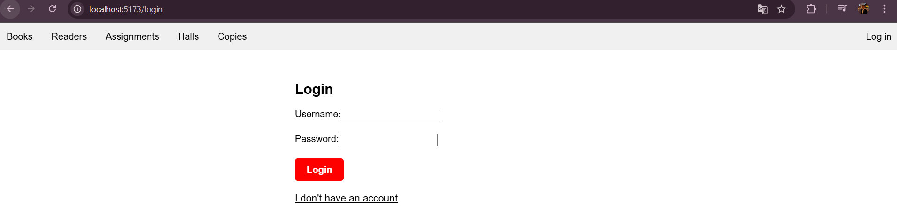

#### Страница регистрации:
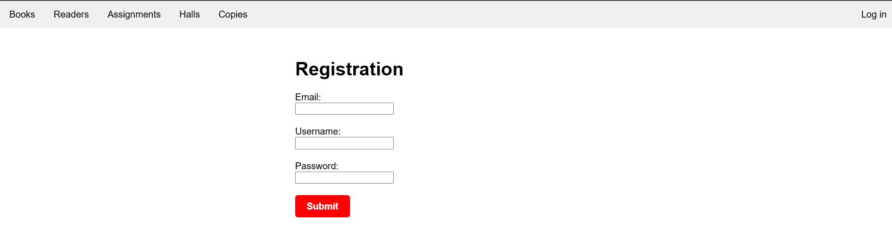

#### Без входа в аккаунт можно посетить страницу All Books:
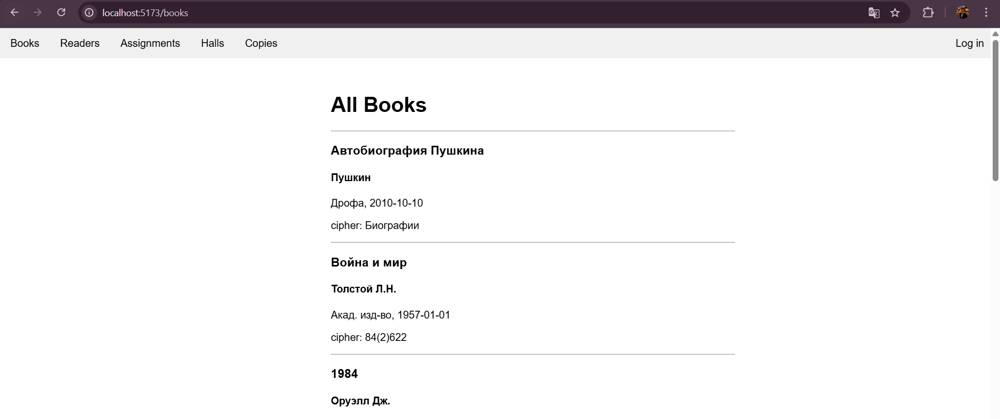

#### Внесение новой книги:
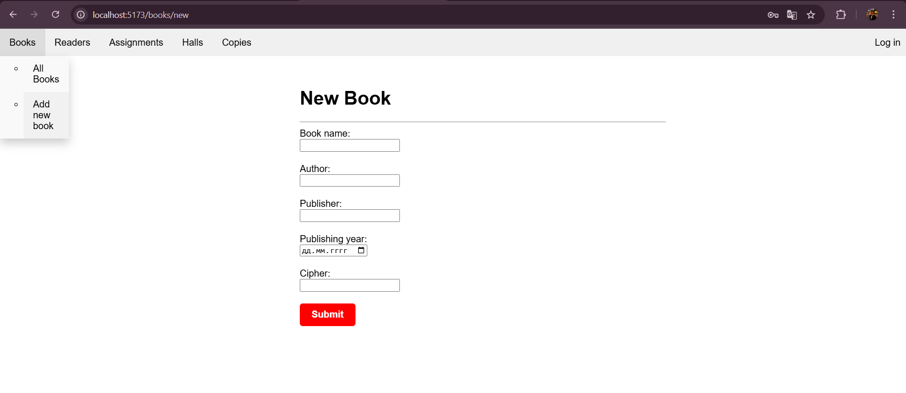

#### Список всех читателей:
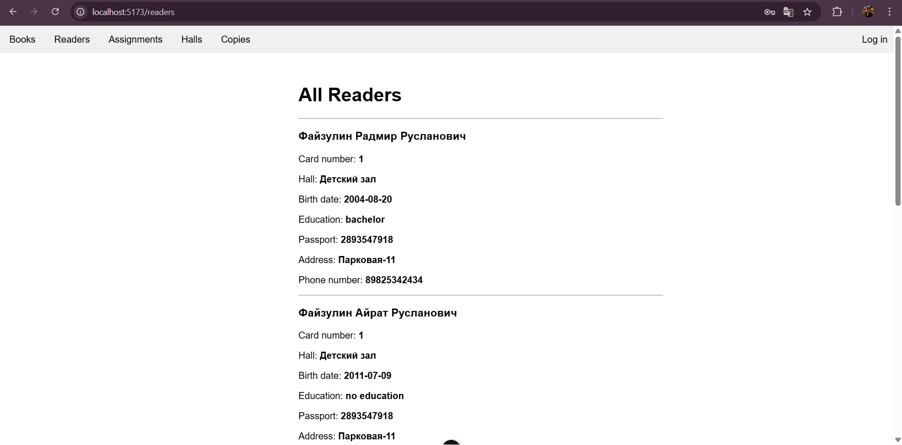

#### Создание нового читательского билета:
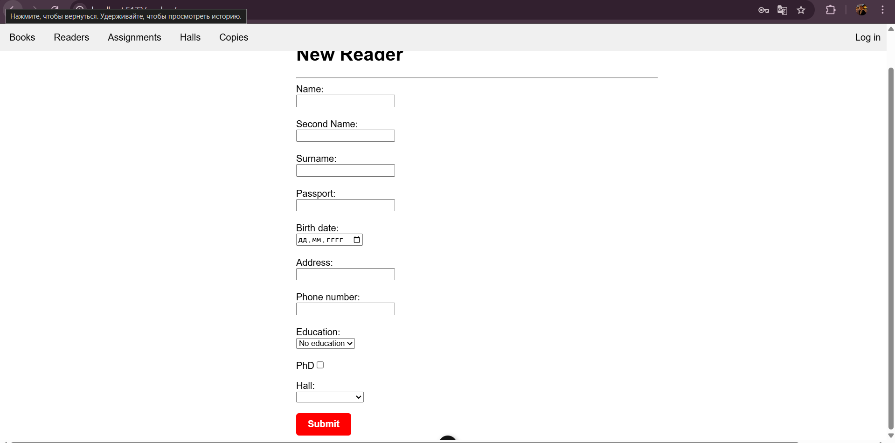

#### Список всех выданных книг:
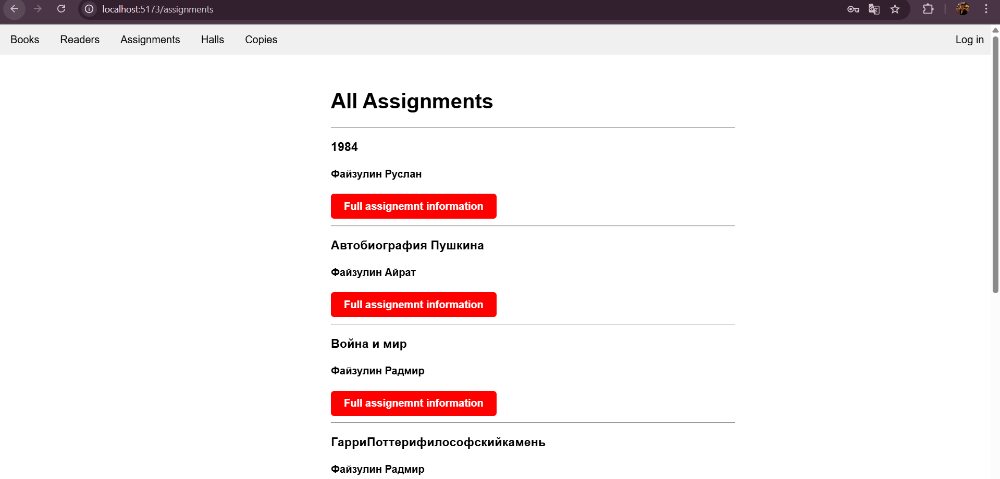

#### Детали выдачи:
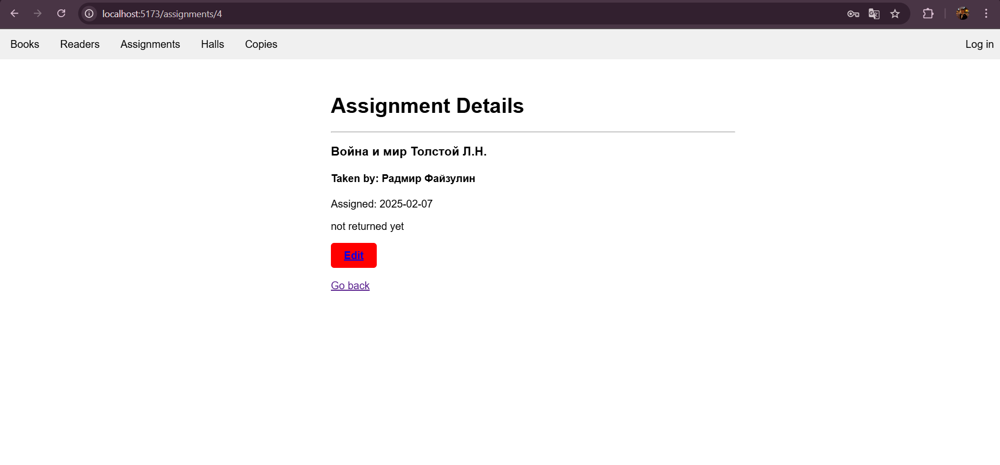

#### Изменение условий выдачи:
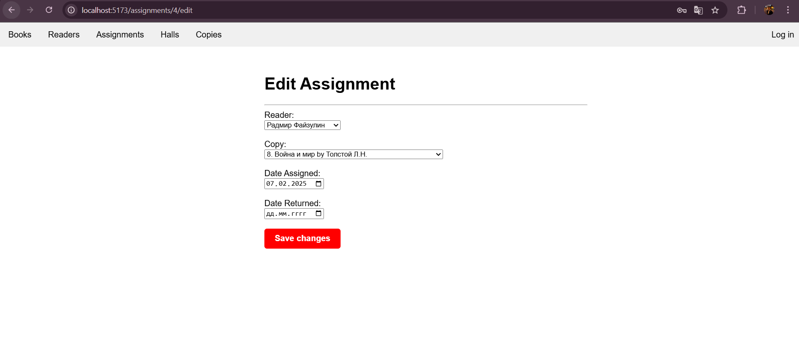

#### Новая выдача книги:
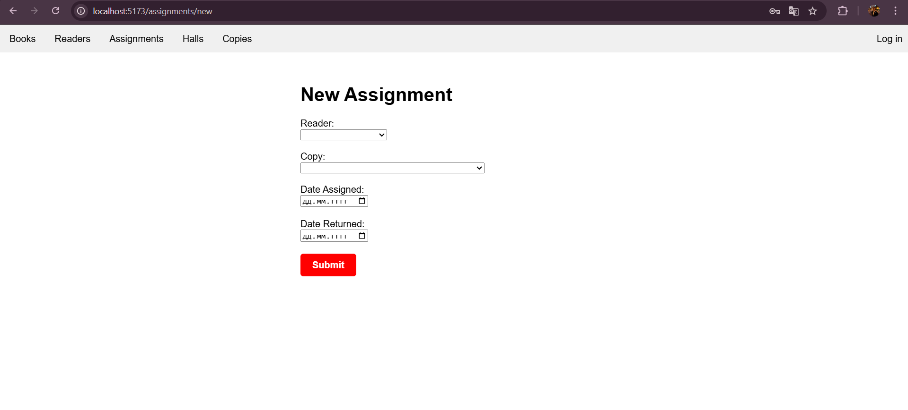

#### Список всех залов:
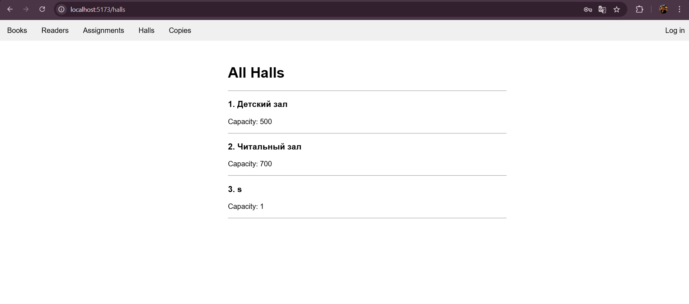

#### Создание нового зала:
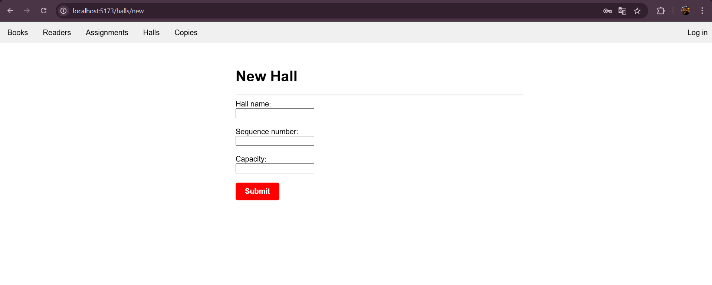

#### Все экземпляры книг:
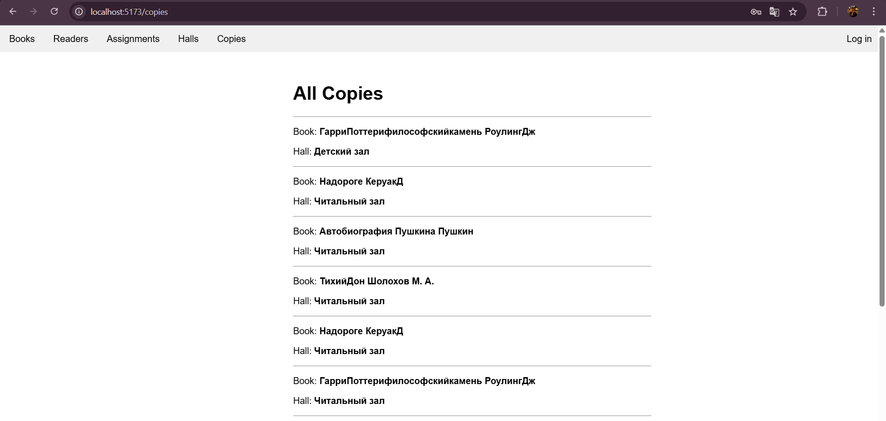

#### Создание нового экземпляра книги:
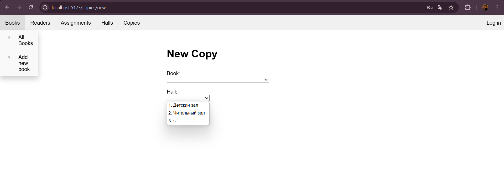

#### Логаут:
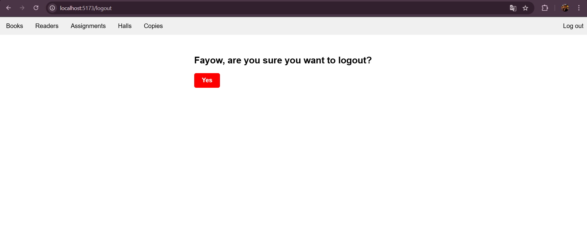

## Спасибо огромное за курс, это было довольно-таки интересно и очень познавательно!