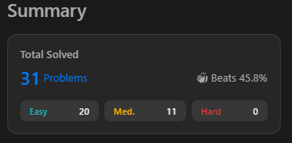

# Leetcodes

### 1. Zigzag Conversion
The string "PAYPALISHIRING" is written in a zigzag pattern on a given number of rows like this: (you may want to display this pattern in a fixed font for better legibility)
P   A   H   N
A P L S I I G
Y   I   R
And then read line by line: "PAHNAPLSIIGYIR"
Write the code that will take a string and make this conversion given a number of rows:
string convert(string s, int numRows);

```
class Solution:
    def convert(self, s: str, numRows: int) -> str:
        template = list(range(numRows)) + list(range(numRows - 2, 0, -1))

        result = [''] * numRows
        for i, char in enumerate(s):
            result[template[i % len(template)]] += char
        return ''.join(result)
```

### 2. String to Integer (atoi)
Implement the myAtoi(string s) function, which converts a string to a 32-bit signed integer.

The algorithm for myAtoi(string s) is as follows:

Whitespace: Ignore any leading whitespace (" ").
Signedness: Determine the sign by checking if the next character is '-' or '+', assuming positivity if neither present.
Conversion: Read the integer by skipping leading zeros until a non-digit character is encountered or the end of the string is reached. If no digits were read, then the result is 0.
Rounding: If the integer is out of the 32-bit signed integer range [-231, 231 - 1], then round the integer to remain in the range. Specifically, integers less than -231 should be rounded to -231, and integers greater than 231 - 1 should be rounded to 231 - 1.
Return the integer as the final result.
```
class Solution(object):
    def myAtoi(self, s):
        num = '0123456789'
        res = ''
        for x in s:
            if x == ' ' and len(res) == 0:
                continue
            if x != ' ' and (x in '-+' or x in num) and len(res) == 0:
                res += x
            elif x in num:
                res += x
            else:
                break
        if res == '' or res in '-+':
            return 0
        else:
            if int(res) < -(2**31):
                return -(2**31)
            elif int(res) > (2**31 - 1):
                return (2**31 - 1)
            else:
                return int(res)
```

### 3. Container With Most Water
You are given an integer array height of length n. There are n vertical lines drawn such that the two endpoints of the ith line are (i, 0) and (i, height[i]).

Find two lines that together with the x-axis form a container, such that the container contains the most water.

Return the maximum amount of water a container can store.

Notice that you may not slant the container.
```
class Solution:
    def maxArea(self, height: List[int]) -> int:
        maxx = 0 
        i = 0
        j = len(height)-1
        while i < j:
            width = abs(i-j)
            area = width * min(height[i],height[j])
            maxx = max(area,maxx)
            if height[i] > height[j]:
                j -=1
            else:
                i +=1
        return maxx 
```

### 4. 3Sum
Given an integer array nums, return all the triplets [nums[i], nums[j], nums[k]] such that i != j, i != k, and j != k, and nums[i] + nums[j] + nums[k] == 0.

Notice that the solution set must not contain duplicate triplets.
```
class Solution:
    def threeSum(self, nums: List[int]) -> List[List[int]]:
        nums = sorted(nums)
        result = set()
        for i in range(len(nums)):
            l = i + 1
            r = len(nums) - 1
            target = 0 - nums[i]
            while l < r:
                if nums[l] + nums[r] == target:
                    result.add((nums[i], nums[l], nums[r]))
                    l += 1
                    r -= 1
                elif nums[l] + nums[r] < target:
                    l += 1
                else:
                    r -= 1
        return list(result)
```

### 5. Generate Parentheses
Given n pairs of parentheses, write a function to generate all combinations of well-formed parentheses.
```
class Solution:
    def generateParenthesis(self, n: int) -> List[str]:
        dp ={}
        dp[1] = ["()"]
        dp[2] = ["(())","()()"]
        for i in range(3,n+1):
            d = {}
            arr = []
            for st in dp[i-1]:
                for j in range(0,len(st)):
                    new = st[0:j]+"()"+st[j:len(st)]
                    if new not in d:
                        d[new] = 1
                        arr.append(new)
            dp[i] = arr
        return dp[n]
```

### 6. Swap Nodes in Pairs
Given a linked list, swap every two adjacent nodes and return its head. You must solve the problem without modifying the values in the list's nodes (i.e., only nodes themselves may be changed.)
```
class Solution:
    def swapPairs(self, head: Optional[ListNode]) -> Optional[ListNode]:
        if not head or not head.next:
            return head
        
        ans = ListNode(0)
        ans.next = head
        curr = ans
        
        while curr.next and curr.next.next:
            t1 = curr.next
            t2 = curr.next.next
            curr.next = t2
            t1.next = t2.next
            t2.next = t1
            curr = curr.next.next
        
        return ans.next
```

### 7. Longest Palindromic Substring
Given a string s, return the longest palindromic substring in s.
```
class Solution:
    def longestPalindrome(self, s: str) -> str:
        if len(s) <= 1:
            return s
        
        Max_Len=1
        Max_Str=s[0]
        for i in range(len(s)-1):
            for j in range(i+1,len(s)):
                if j-i+1 > Max_Len and s[i:j+1] == s[i:j+1][::-1]:
                    Max_Len = j-i+1
                    Max_Str = s[i:j+1]

        return Max_Str
```

### 8. Palindrome Number
Given an integer x, return true if x is a palindrome, and false otherwise.
```
class Solution:
    def isPalindrome(self, x: int) -> bool:
        if x < 0 or (x % 10 == 0 and x != 0):
            return False
        revertedNumber = 0
        while x > revertedNumber:
            revertedNumber = revertedNumber * 10 + x % 10
            x //= 10
        return x == revertedNumber or x == revertedNumber // 10
```

### 9. Longest Common Prefix
Write a function to find the longest common prefix string amongst an array of strings.

If there is no common prefix, return an empty string "".
```
class Solution:
    def longestCommonPrefix(self, strs: List[str]) -> str:
        pref = strs[0]
        pref_len = len(pref)

        for s in strs[1:]:
            while pref != s[0:pref_len]:
                pref_len -= 1
                if pref_len == 0:
                    return ""
                
                pref = pref[0:pref_len]
        
        return pref
```

### 10. Valid Parentheses
Given a string s containing just the characters '(', ')', '{', '}', '[' and ']', determine if the input string is valid.

An input string is valid if:

Open brackets must be closed by the same type of brackets.
Open brackets must be closed in the correct order.
Every close bracket has a corresponding open bracket of the same type.
```
class Solution:
    def isValid(self, s: str) -> bool:
        while len(s) > 0:
            l = len(s)
            s = s.replace('()','').replace('{}','').replace('[]','')
            if l==len(s): return False
        return True
```

### 11. Remove Duplicates from Sorted Array
Given an integer array nums sorted in non-decreasing order, remove the duplicates in-place such that each unique element appears only once. The relative order of the elements should be kept the same. Then return the number of unique elements in nums.

Consider the number of unique elements of nums to be k, to get accepted, you need to do the following things:

Change the array nums such that the first k elements of nums contain the unique elements in the order they were present in nums initially. The remaining elements of nums are not important as well as the size of nums.
Return k.
```
class Solution:
    def removeDuplicates(self, nums: List[int]) -> int:
        nums[:] = sorted(set(nums))
        return len(nums)
```

### 12. Remove Element
Given an integer array nums and an integer val, remove all occurrences of val in nums in-place. The order of the elements may be changed. Then return the number of elements in nums which are not equal to val.

Consider the number of elements in nums which are not equal to val be k, to get accepted, you need to do the following things:

Change the array nums such that the first k elements of nums contain the elements which are not equal to val. The remaining elements of nums are not important as well as the size of nums.
Return k.
```
class Solution:
    def removeElement(self, nums, val):
        i = 0
        for x in nums:
            if x != val:
                nums[i] = x
                i += 1
        return i  
```

### 13. Find the Index of the First Occurrence in a String
Given two strings needle and haystack, return the index of the first occurrence of needle in haystack, or -1 if needle is not part of haystack.
```
class Solution:
    def strStr(self, haystack, needle):
        for i in range(len(haystack) - len(needle) + 1):
            if haystack[i:i+len(needle)] == needle:
                return i
        return -1
```

### 14. Search Insert Position
Given a sorted array of distinct integers and a target value, return the index if the target is found. If not, return the index where it would be if it were inserted in order.

You must write an algorithm with O(log n) runtime complexity.
```
class Solution:
    def searchInsert(self, nums: List[int], target: int) -> int:
        left, right = 0, len(nums) - 1
        
        while left <= right:
            mid = left + (right - left) // 2
            
            if nums[mid] == target:
                return mid
            elif nums[mid] < target:
                left = mid + 1
            else:
                right = mid - 1
        
        return left
```

### 15. Find First and Last Position of Element in Sorted Array
Given an array of integers nums sorted in non-decreasing order, find the starting and ending position of a given target value.

If target is not found in the array, return [-1, -1].

You must write an algorithm with O(log n) runtime complexity.
```
class Solution:
    def searchRange(self, nums: List[int], target: int) -> List[int]:
        
        def search(x):
            lo, hi = 0, len(nums)           
            while lo < hi:
                mid = (lo + hi) // 2
                if nums[mid] < x:
                    lo = mid+1
                else:
                    hi = mid                    
            return lo
        
        lo = search(target)
        hi = search(target+1)-1
        
        if lo <= hi:
            return [lo, hi]
                
        return [-1, -1]
```

### 16. Count and Say
The count-and-say sequence is a sequence of digit strings defined by the recursive formula:
```
class Solution:
    def countAndSay(self, n: int) -> str:
        output = '1'
        
        for i in range(2, n+1):
            res = ''
            cur = output[0]
            count = 1
            for x in output[1:]:
                if x == cur:
                    count += 1
                else:
                    res += str(count) + cur
                    count = 1
                    cur = x
                
            res += str(count) + cur
            output = ''.join(res)
            
        return output
```

### 17. Multiply Strings
Given two non-negative integers num1 and num2 represented as strings, return the product of num1 and num2, also represented as a string.

Note: You must not use any built-in BigInteger library or convert the inputs to integer directly.
```
class Solution:
    def multiply(self, num1: str, num2: str) -> str:
        if num1 == '0' or num2 == '0':
            return '0'
        
        def decode(num):
            ans = 0
            for i in num:
                ans = ans*10 +(ord(i) - ord('0'))
            return ans

        def encode(s):
            news = ''
            while s:
                a = s % 10
                s = s // 10
                news = chr(ord('0') + a) + news
            return news
        
        return encode(decode(num1)*decode(num2))
```

### 18. Combination Sum
Given an array of distinct integers candidates and a target integer target, return a list of all unique combinations of candidates where the chosen numbers sum to target. You may return the combinations in any order.

The same number may be chosen from candidates an unlimited number of times. Two combinations are unique if the frequency of at least one of the chosen numbers is different.

The test cases are generated such that the number of unique combinations that sum up to target is less than 150 combinations for the given input.
```
class Solution:
    def combinationSum(self, candidates: List[int], target: int) -> List[List[int]]:
            
        res = []

        def make_combination(idx, comb, total):
            if total == target:
                res.append(comb[:])
                return
            
            if total > target or idx >= len(candidates):
                return
            
            comb.append(candidates[idx])
            make_combination(idx, comb, total + candidates[idx])
            comb.pop()
            make_combination(idx+1, comb, total)

            return res

        return make_combination(0, [], 0)
```

### 19. Valid Parentheses
Given a string s containing just the characters '(', ')', '{', '}', '[' and ']', determine if the input string is valid.

An input string is valid if:

Open brackets must be closed by the same type of brackets.
Open brackets must be closed in the correct order.
Every close bracket has a corresponding open bracket of the same type.
```
class Solution(object):
    def isValid(self, s):
        opcl = dict(('()', '[]', '{}'))
        stack = []
        for idx in s:
            if idx in '([{':
                stack.append(idx)
            elif len(stack) == 0 or idx != opcl[stack.pop()]:
                return False
        return len(stack) == 0
```

### 20. Merge Two Sorted Lists
You are given the heads of two sorted linked lists list1 and list2.

Merge the two lists into one sorted list. The list should be made by splicing together the nodes of the first two lists.

Return the head of the merged linked list.
```
class Solution:
    def mergeTwoLists(self, l1: ListNode, l2: ListNode) -> ListNode:   
        dummy = temp = ListNode(0)
        while l1 != None and l2 != None: #1

            if l1.val < l2.val: #2
                temp.next = l1 #3
                l1 = l1.next #4
            else: 
                temp.next = l2
                l2 = l2.next
            temp = temp.next
        temp.next = l1 or l2  #5
        return dummy.next #6
```

### 21. Plus One
You are given a large integer represented as an integer array digits, where each digits[i] is the ith digit of the integer. The digits are ordered from most significant to least significant in left-to-right order. The large integer does not contain any leading 0's.

Increment the large integer by one and return the resulting array of digits.
```
class Solution:
    def plusOne(self, digits: List[int]) -> List[int]:
        if digits[-1] < 9:
            digits[-1] += 1
            return digits
        elif len(digits) == 1 and digits[0] == 9:
            return [1, 0]
        else:
            digits[-1] = 0
            digits[0:-1] = self.plusOne(digits[0:-1])
            return digits
```

### 22. Sqrt(x)
Given a non-negative integer x, return the square root of x rounded down to the nearest integer. The returned integer should be non-negative as well.

You must not use any built-in exponent function or operator.

For example, do not use pow(x, 0.5) in c++ or x ** 0.5 in python.
```
class Solution:
    def mySqrt(self, x: int) -> int:
        number=1
        while number*number<=x:
            number+=1
        return number-1
```

### 23. Climbing Stairs
You are climbing a staircase. It takes n steps to reach the top.

Each time you can either climb 1 or 2 steps. In how many distinct ways can you climb to the top?
```
class Solution:
    def climbStairs(self, n: int) -> int:
        memo = {}
        return self.helper(n, memo)
    
    def helper(self, n: int, memo: dict[int, int]) -> int:
        if n == 0 or n == 1:
            return 1
        if n not in memo:
            memo[n] = self.helper(n-1, memo) + self.helper(n-2, memo)
        return memo[n]
```

### 24. Remove Duplicates from Sorted List
Given the head of a sorted linked list, delete all duplicates such that each element appears only once. Return the linked list sorted as well.
```
class Solution:
    def deleteDuplicates(self, head: ListNode) -> ListNode:
        cur=head
        while cur:
            while cur.next and cur.next.val==cur.val:
                cur.next=cur.next.next
            cur=cur.next
        return head
```

### 25. Merge Sorted Array
You are given two integer arrays nums1 and nums2, sorted in non-decreasing order, and two integers m and n, representing the number of elements in nums1 and nums2 respectively.

Merge nums1 and nums2 into a single array sorted in non-decreasing order.

The final sorted array should not be returned by the function, but instead be stored inside the array nums1. To accommodate this, nums1 has a length of m + n, where the first m elements denote the elements that should be merged, and the last n elements are set to 0 and should be ignored. nums2 has a length of n.
```
class Solution:
    def merge(self, nums1: List[int], m: int, nums2: List[int], n: int) -> None:
        if n == 0 :return
        len1 = len(nums1)
        end_idx = len1-1
        while n > 0 and m > 0 :
            if nums2[n-1] >= nums1[m-1]:
                nums1[end_idx] = nums2[n-1]
                n-=1
            else:
                nums1[end_idx] = nums1[m-1]
                m-=1
            end_idx-=1
        while n > 0:
            nums1[end_idx] = nums2[n-1]
            n-=1
            end_idx-=1
```

### 26. Path Sum
Given the root of a binary tree and an integer targetSum, return true if the tree has a root-to-leaf path such that adding up all the values along the path equals targetSum.

A leaf is a node with no children.
```
class Solution:
    def hasPathSum(self, root: Optional[TreeNode], targetSum: int) -> bool:
        if not root:
            return False
        
        if not root.left and not root.right:
            return targetSum == root.val
        
        left_sum = self.hasPathSum(root.left, targetSum - root.val)
        right_sum = self.hasPathSum(root.right, targetSum - root.val)
        
        return left_sum or right_sum
```

### 27. Pascal's Triangle
Given an integer numRows, return the first numRows of Pascal's triangle.
```
class Solution:
    def generate(self, numRows: int) -> List[List[int]]:
        if numRows == 0:
            return []
        if numRows == 1:
            return [[1]]
        
        prevRows = self.generate(numRows - 1)
        newRow = [1] * numRows
        
        for i in range(1, numRows - 1):
            newRow[i] = prevRows[-1][i - 1] + prevRows[-1][i]
        
        prevRows.append(newRow)
        return prevRows
```

### 28. Single Number
Given a non-empty array of integers nums, every element appears twice except for one. Find that single one.

You must implement a solution with a linear runtime complexity and use only constant extra space.
```
class Solution:
  def singleNumber(self, nums: List[int]) -> int:
    return functools.reduce(lambda x, y: x ^ y, nums, 0)
```

### 29. Majority Element
Given an array nums of size n, return the majority element.

The majority element is the element that appears more than ⌊n / 2⌋ times. You may assume that the majority element always exists in the array.
```
import statistics
f = open("user.out", 'w')
for line in stdin:
    l = sorted(map(int, line.rstrip()[1:-1].split(',')))
    print(l[len(l) // 2], file=f)
exit(0)
```

### 30. Happy Number
Write an algorithm to determine if a number n is happy.

A happy number is a number defined by the following process:

Starting with any positive integer, replace the number by the sum of the squares of its digits.
Repeat the process until the number equals 1 (where it will stay), or it loops endlessly in a cycle which does not include 1.
Those numbers for which this process ends in 1 are happy.
Return true if n is a happy number, and false if not.
```
class Solution:
    def isHappy(self, n: int) -> bool:
        while n != 1:
            n = sum([int(i) ** 2 for i in str(n)])
            if n == 4:
                return False
        
        return True
```

### 31. Isomorphic Strings
Given two strings s and t, determine if they are isomorphic.

Two strings s and t are isomorphic if the characters in s can be replaced to get t.

All occurrences of a character must be replaced with another character while preserving the order of characters. No two characters may map to the same character, but a character may map to itself.
```
class Solution(object):
    def isIsomorphic(self, s, t):
        map1 = []
        map2 = []
        for idx in s:
            map1.append(s.index(idx))
        for idx in t:
            map2.append(t.index(idx))
        if map1 == map2:
            return True
        return False
```

### 32. Fibonacci Number
The Fibonacci numbers, commonly denoted F(n) form a sequence, called the Fibonacci sequence, such that each number is the sum of the two preceding ones, starting from 0 and 1. 
```
class Solution:
    def fib(self, N: int) -> int:
    	a, b = 0, 1
    	for i in range(N): a, b = b, a + b
    	return a
```

### 33. Find Common Characters
Given a string array words, return an array of all characters that show up in all strings within the words (including duplicates). You may return the answer in any order.
```
class Solution:
    def commonChars(self, words: List[str]) -> List[str]:
        min_freq = Counter(words[0])
        for word in words:
            min_freq &= Counter(word)
        return list(min_freq.elements())
```

Нужно было 31, но я видимо случайно два решил повторно,
поэтому выше их 33, а на скрине всего 31.

Спасибо огромное за курс!